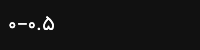
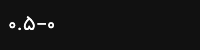

# تست ۲: بازبینی RTL

**وضعیت: ⚠️ FAIL جزئی — ۲ باگ واقعی پیدا و با شواهد اجرایی اثبات شد، بقیه موارد PASS**

بازبینی کد-محور + شواهد گرفته‌شده با اجرای واقعی (`qa-reports/tools/02-rtl-capture.js`)، نه فقط چشمی.

## جدول خلاصه

| مؤلفه | وضعیت | severity |
|---|---|---|
| برچسب محورهای نمودار توزیع R:R (canvas) | 🔴 باگ‌دار | **بالا** — عدد نمایش‌داده‌شده گمراه‌کننده است |
| هفته شروع در تقویم P&L / یادداشت ژورنال | 🔴 باگ‌دار (ناسازگار با تقویم اصلی هاب) | متوسط |
| ترتیب ستون‌های جدول تاریخچهٔ ژورنال | ✅ درست | — |
| تقویم اقتصادی هاب (چیدمان، پیکان ناوبری، ترتیب ستون‌ها) | ✅ درست | — |
| نمودار Equity Curve (canvas) | ✅ درست (LTR عمدی، طبق قرارداد جهانی چارت مالی) | — |
| قیمت‌ها/نمادها/تاریخ‌ها در سراسر برنامه | ✅ درست (LTR اجباری با `direction:ltr` در CSS) | — |

---

## ۱. نمودار «توزیع R:R» (`<canvas id="an-rr">` در `js/journal.js`) — 🔴 باگ واقعی، اثبات‌شده

### چرا این مورد را دقیق بررسی کردم
دقیقاً همان چیزی که در بریف این تسک به‌عنوان «پرریسک‌ترین مورد» علامت خورده بود: نمودارها با `<canvas>` خام کشیده می‌شوند (بدون کتابخانه)، و Canvas 2D API برخلاف HTML معمولی، متن را طبق `ctx.direction` با الگوریتم Bidi یونیکد بازچینی می‌کند.

### شواهد (نه حدس — خروجی واقعی اجرا)

```
canvas #an-rr computed direction: rtl | ctx.direction at draw time: rtl
```

`js/journal.js` تابع `setupCanvas()` (خط ۱۳۷۳) هیچ‌جا `ctx.direction` را ست نمی‌کند، پس این مقدار از `<html dir="rtl">` به ارث می‌رسد. برچسب‌های bucket در `Analytics.rrHistogram` (خط ۳۶۴-۳۶۹) این‌طور تعریف شده‌اند:

```js
{ label:'۰–۰.۵', min:0, max:0.5 }, { label:'۰.۵–۱', min:0.5, max:1 }, ...
```

یعنی قصد نویسنده «کم–زیاد» (0 to 0.5) است. برای اثبات اینکه Bidi واقعاً این رشته را بازمی‌چیند، دقیقاً همین رشته (`'۰–۰.۵'`) را یک‌بار با `ctx.direction='ltr'` و یک‌بار با `'rtl'` روی یک canvas آزمایشی (دقیقاً همان فونت/سایز) رندر کردم:

| `direction: 'ltr'` (خروجی مورد انتظار) | `direction: 'rtl'` (خروجی واقعی اپ) |
|---|---|
|  |  |
| می‌خواند: «۰–۰.۵» (۰ تا ۰.۵) ✅ | می‌خواند: «۰.۵–۰» (۰.۵ تا ۰ — معکوس!) ❌ |

پیکسل این دو رندر **متفاوت** است (`identical: false`) — یعنی این یک فرض نظری نیست، دقیقاً همین چیزی است که کاربر روی نمودار واقعی می‌بیند (اسکرین‌شات کامل: `screenshots/rtl-journal-rr-histogram.png`).

### تأثیر
هر ۶ برچسب bucket نمودار «توزیع R:R» با ترتیب معکوس («زیاد–کم» به‌جای «کم–زیاد») نمایش داده می‌شوند. برای یک معامله‌گر که دارد نسبت ریسک‌به‌ریوارد معاملاتش را آنالیز می‌کند، این می‌تواند مستقیماً باعث خوانش اشتباه شود (مثلاً برچسب واقعی روی صفحه «۲–۱.۵» به‌جای «۱.۵–۲» دیده می‌شود).

### فایل و خط دقیق
`js/journal.js:1373-1381` (`setupCanvas`) — نقطهٔ اصلاح مرکزی، چون هم `drawEquityCurve` (۱۳۸۳) و هم `drawRRHistogram` (۱۴۵۹) از همین تابع استفاده می‌کنند.

### پیشنهاد اصلاح
```js
function setupCanvas(canvas, h) {
  var dpr = window.devicePixelRatio || 1;
  var w = canvas.parentElement.clientWidth - 0;
  canvas.style.width = w + 'px'; canvas.style.height = h + 'px';
  canvas.width = w * dpr; canvas.height = h * dpr;
  var ctx = canvas.getContext('2d');
  ctx.direction = 'ltr';   // ← اضافه شود: اعداد/بازه‌های چارت باید مثل بقیهٔ برنامه LTR بمانند
  ctx.setTransform(dpr, 0, 0, dpr, 0, 0);
  return { ctx: ctx, w: w, h: h };
}
```
این یک‌خط، همهٔ متن‌های canvas در این فایل را همسو با بقیهٔ برنامه می‌کند (که در جاهای دیگر مثل `.c-chg`/`.cm-row-sym` در `newtab.css` عمداً `direction:ltr` روی داده‌های عددی می‌گذارد — همان الگو، این‌جا فراموش شده بود).

---

## ۲. هفتهٔ تقویم در ژورنال (P&L heatmap + یادداشت‌های روزانه) — 🔴 ناسازگار با تقویم اصلی هاب

### مقایسهٔ کد
`js/hub.js` تقویم اصلی (اقتصادی) را با یک remap صریح می‌سازد تا هفته با **شنبه** شروع شود — مطابق قرارداد تقویم ایرانی:

```js
// js/hub.js:160
function jDow(jy,jm,jd){ var g=j2g(jy,jm,jd); return (new Date(g[0],g[1]-1,g[2]).getDay()+1)%7; }
```
و هدر روزهای هفته هم به همین ترتیب هاردکد شده (`js/hub.js:193`): `ش ی د س چ پ ج` (شنبه اول).

اما `js/journal.js` در **دو جای مختلف** (`drawMonthGrid` خط ۱۵۳۱، و تقویم یادداشت‌های روزانه خط ۱۶۱۶) مستقیم از `first.getDay()` استفاده می‌کند — بدون remap:

```js
// js/journal.js:1531  و  js/journal.js:1616 (تکرار همین الگو)
var startDay = first.getDay();   // 0=یکشنبه — بدون (+1)%7
```
و هدر روزهایش (خط ۱۵۵۳ و ۱۶۲۹) `['ی','د','س','چ','پ','ج','ش']` است — یعنی **یکشنبه اول**.

### تأثیر
همان کاربری که در حالت Hub تقویمش را شنبه‌شروع می‌بیند، وقتی وارد ژورنال معاملاتی می‌شود (تب آمار → توزیع روزانه، یا تب پلی‌بوک → یادداشت روزانه)، تقویمی می‌بیند که هفته را یکشنبه شروع می‌کند — ناسازگاری بصری بین دو بخش از همان محصول. این خودش باگ RTL خالص نیست (هر دو گرید از نظر چیدمان RTL درست کار می‌کنند — ستون اول در سمت راست می‌نشیند چون هیچ `direction:ltr` روی `.jr-heat-grid` نیست)، بلکه یک ناسازگاری قرارداد تقویم فارسی بین دو ویجت است.

### یافتهٔ جانبی (فراتر از RTL، ارزش ثبت دارد)
هر دو تابع calendar-heatmap در `journal.js` از ماه‌های میلادی با نام فارسی استفاده می‌کنند (`monthsFa = ['ژانویه','فوریه',...]`، خط ۱۴۶۲ و ۱۶۱۴) — یعنی این دو تقویم کلاً **میلادی** هستند، درحالی‌که بقیهٔ برنامه (هاب، هدر ساعت) پیش‌فرض **شمسی** است و حتی سوییچ شمسی/میلادی هم دارد. این یک ناسازگاری محصولی بزرگ‌تر است، نه صرفاً ترتیب هفته — پیشنهاد می‌شود جدا (خارج از این تسک ۷تایی) بررسی شود که آیا این دو تقویم ژورنال باید هم به Jalali مهاجرت کنند.

### پیشنهاد اصلاح (برای مطابقت با هاب)
در هر دو تابع (`js/journal.js:1531` و `:1616`):
```js
var startDay = (first.getDay() + 1) % 7;   // شنبه=۰ به‌جای یکشنبه=۰
```
و هدر روزها را از `['ی','د','س','چ','پ','ج','ش']` به `['ش','ی','د','س','چ','پ','ج']` تغییر دهید (هر دو خط ۱۵۵۳ و ۱۶۲۹).

---

## ۳. جدول تاریخچهٔ معاملات (`js/journal.js`، تب «تاریخچه») — ✅ درست

اسکرین‌شات واقعی: `screenshots/rtl-journal-history-table.png`.

ترتیب ستون‌ها راست‌به‌چپ (یعنی همان چیزی که یک خوانندهٔ فارسی اول می‌بیند، سمت راست): **تاریخ → نماد → جهت → ورود → خروج → SL → TP → حجم → پیپP&L → $P&L → R:R → ستاپ → وضعیت**. این ترتیب کاملاً منطقی است — مهم‌ترین/شناسایی‌کننده‌ترین ستون‌ها (تاریخ، نماد) اول (راست) و ستون‌های محاسبه‌شده/خلاصه (R:R، ستاپ، وضعیت) آخر (چپ) می‌آیند. این «معکوس‌سازی معنایی اعداد» نیست — دقیقاً چیزی که این تسک هشدار داده بود که نباید اتفاق بیفتد، این‌جا نیفتاده: مقادیر عددی/تاریخ داخل هر سلول (`2026-08-11`, `1.271`, `63000`) بدون تغییر و LTR نمایش داده می‌شوند؛ فقط توالی *ستون‌ها* برای خوانش RTL چیده شده که کاملاً درست است.

`.jr-table` (`newtab.css:5608`) هیچ override جهتی ندارد و به‌درستی از `<html dir="rtl">` ارث می‌برد؛ `th { text-align: right }` (خط ۵۶۱۶) هم منطبق است.

---

## ۴. تقویم اقتصادی هاب (`js/hub.js`) — ✅ درست

- **چیدمان ردیف‌ها**: هفته با شنبه شروع می‌شود (بخش ۲ بالا را ببینید) — مطابق قرارداد ایرانی، و با remap صحیح `(getDay()+1)%7`.
- **جهت پیکان‌های ماه قبل/بعد** (`js/hub.js:185-190`): دکمهٔ «ماه قبل» (`#hub-cal-prev`) که در چیدمان RTL سمت **راست** می‌نشیند، یک پیکان **راست‌گرد** (`M9 6l6 6-6 6`) دارد؛ دکمهٔ «ماه بعد» سمت **چپ**، پیکان **چپ‌گرد** (`M15 6l-6 6 6 6`) دارد. این دقیقاً آینهٔ صحیح قرارداد LTR معمول (prev=چپ+پیکان‌چپ، next=راست+پیکان‌راست) است — نه باگ.
- **ترتیب ستون‌های تاریخ**: `.hcal-weekdays`/`.hcal-days` (`newtab.css:6572-6592`) گرید بدون override جهت‌اند، پس به‌درستی از راست شروع می‌شوند.

---

## ۵. نمودار Equity Curve — ✅ درست (تصمیم محصولی صریح، نه باگ)

محور X این نمودار (تاریخ معاملات، صعودی از راست نمودار به چپ در `screenshots/rtl-journal-analytics.png`... در واقع از **چپ به راست** مثل هر چارت مالی جهانی) با گذر زمان چپ‌به‌راست پیش می‌رود، دقیقاً مثل TradingView یا هر پلتفرم دیگر. برچسب‌های `$` روی محور Y (`'$' + Math.round(val).toLocaleString('en-US')`, خط ۱۴۰۲) رشته‌ای کاملاً لاتین/عددی هستند (بدون رقم فارسی) پس مشکل Bidi بالا آن‌ها را تحت تأثیر قرار نمی‌دهد — با شواهد بصری تأیید شد.

**این عمداً مستند می‌شود تا اشتباه تلقی نشود**: جهت جهانی LTR برای چارت‌های مالی (چه Equity Curve، چه هر کندل‌استیک دیگری در آینده) درست است و نباید معکوس شود — برخلاف مورد #۱ که یک باگ Bidi ناخواسته بود، نه یک تصمیم.

---

## فایل‌های شاهد

```
qa-reports/tools/02-rtl-capture.js          ← اسکریپت قابل‌اجرای مجدد
qa-reports/screenshots/rtl-journal-history-table.png
qa-reports/screenshots/rtl-journal-rr-histogram.png
qa-reports/screenshots/bidi-proof-ltr.png   ← رندر کنترل‌شده: همان برچسب، direction:ltr
qa-reports/screenshots/bidi-proof-rtl.png   ← رندر کنترل‌شده: همان برچسب، direction:rtl (=واقعیت اپ)
```
