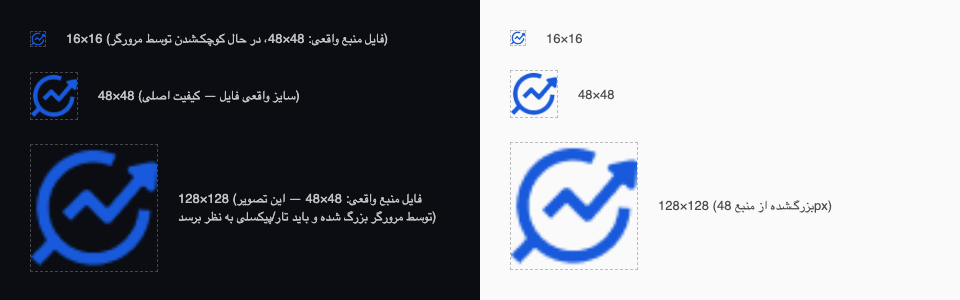

# بازبینی آیکون‌ها

بررسی‌شده با `file` (نه حدس) روی فایل‌های واقعی در `icons/`، ۲۰۲۶-۰۸-۱۵.

## ⚠️ یافتهٔ اصلی: هر ۵ فایل، یک تصویر ۴۸×۴۸ کپی‌شده با نام‌های مختلف‌اند

```
$ file icons/*.png
icons/favicon.png:  PNG image data, 48 x 48, 8-bit/color RGBA, non-interlaced
icons/icon128.png:  PNG image data, 48 x 48, 8-bit/color RGBA, non-interlaced
icons/icon16.png:   PNG image data, 48 x 48, 8-bit/color RGBA, non-interlaced
icons/icon32.png:   PNG image data, 48 x 48, 8-bit/color RGBA, non-interlaced
icons/icon48.png:   PNG image data, 48 x 48, 8-bit/color RGBA, non-interlaced

$ md5 icons/*.png
MD5 (icons/favicon.png) = cdce1c174a2fa639cccf5d4074d5559b
MD5 (icons/icon128.png) = cdce1c174a2fa639cccf5d4074d5559b
MD5 (icons/icon16.png)  = cdce1c174a2fa639cccf5d4074d5559b
MD5 (icons/icon32.png)  = cdce1c174a2fa639cccf5d4074d5559b
MD5 (icons/icon48.png)  = cdce1c174a2fa639cccf5d4074d5559b
```

هر ۵ فایل **دقیقاً همان بایت‌ها** را دارند (MD5 یکسان) — یعنی یک تصویر ۴۸×۴۸ پیکسل با ۵ اسم مختلف کپی شده، نه ۴ سایز واقعاً متفاوت. `manifest.json` ادعا می‌کند این فایل‌ها به‌ترتیب ۱۶، ۳۲، ۴۸ و ۱۲۸ پیکسل هستند، ولی هیچ‌کدام (به‌جز ۴۸، که تصادفاً همان سایز منبع است) واقعاً آن ابعاد را ندارند.

| سایز موردنیاز (طبق manifest.json) | فایل | ابعاد واقعی | وضعیت |
|---|---|---|---|
| 16×16 | `icons/icon16.png` | 48×48 | ❌ باید کوچک شود |
| 32×32 | `icons/icon32.png` | 48×48 | ❌ باید کوچک شود |
| 48×48 | `icons/icon48.png` | 48×48 | ✅ همین الان درست است (تصادفی) |
| 128×128 | `icons/icon128.png` | 48×48 | ❌ باید از یک منبع باکیفیت‌تر ساخته شود — نمی‌شود درست کوچک/بزرگ کرد (پایین توضیح داده شده) |

فرمت PNG با کانال آلفا (شفافیت) در هر ۵ فایل تأیید شد (`8-bit/color RGBA`) — این بخش مشکلی ندارد.

## پیش‌نمایش روی پس‌زمینهٔ تیره/روشن

برای شبیه‌سازی نوار ابزار Chrome در دارک/لایت‌مود، آیکون‌های فعلی (۱۶، ۴۸، ۱۲۸) روی هر دو پس‌زمینه رندر شدند:



**مشاهده:** چون طرح آیکون ساده و مسطح است (خط نمودار + پیکان داخل یک دایرهٔ آبی، نه یک تصویر عکس‌مانند پرجزئیات)، بزرگ‌نمایی ۴۸→۱۲۸ آن‌قدر که برای تصاویر پیچیده معمول است بد به نظر نمی‌رسد — ولی لبه‌ها محسوساً نرم‌تر/کم‌جزئیات‌تر از یک آیکون واقعاً ۱۲۸ پیکسلی هستند، و در کنار آیکون‌های رقبا با آرت‌ورک واقعی با کیفیت پایین‌تر دیده می‌شود. کنتراست روی هر دو پس‌زمینه (آبی روی تیره، آبی روی روشن) خوانا و قابل‌قبول است.

## راه‌حل

### برای 16×16 و 32×32 — قابل تولید همین الان از فایل موجود

چون فایل منبع (۴۸×۴۸) از این دو سایز *بزرگ‌تر* است، کوچک‌کردن یک downscale واقعی و بدون افت کیفیت غیرمنطقی است:

```bash
cd "NewTab Extention/icons"
sips -z 16 16 icon48.png --out icon16.png
sips -z 32 32 icon48.png --out icon32.png
```

این دو دستور امن و بدون افت کیفیت غیرمعمول هستند — `sips` (ابزار داخلی macOS) است، نیازی به نصب چیزی نیست.

### برای 128×128 — نیاز به آرت‌ورک منبع جدید، نه یک دستور ساده

در کل ریپازیتوری هیچ نسخهٔ بزرگ‌تر از ۴۸×۴۸ از این آیکون (SVG یا PNG با رزولوشن بالاتر) پیدا نشد — جست‌وجوی `*.svg`, `*logo*`, `*icon*` در کل پروژه فقط همین ۵ فایل ۴۸px را برگرداند. یعنی:

- **بزرگ‌کردن ساده (`sips -z 128 128 icon48.png`) یک راه‌حل واقعی نیست** — فقط همان تصویر ۴۸px را بزرگ‌نمایی می‌کند (دقیقاً همان چیزی که پیش‌نمایش بالا نشان می‌دهد)، نه یک آیکون واقعاً ۱۲۸ پیکسلی.
- تنها راه‌حل درست: گرفتن آرت‌ورک اصلی (ایده‌آل: فایل وکتور/SVG یا PNG با رزولوشن ۵۱۲×۵۱۲ یا بالاتر از تیم طراحی) و اکسپورت مستقیم در ۱۲۸×۱۲۸ از همان فایل — نه از نسخهٔ ۴۸px.
- اگر فایل منبع باکیفیت‌تر پیدا/ساخته شد، دستور نهایی همین است:
  ```bash
  sips -z 128 128 <منبع-باکیفیت>.png --out icon128.png
  ```

## این تغییرات اعمال نشدند

طبق دامنهٔ این تسک (آماده‌سازی اسناد در `store-submission/`)، فایل‌های واقعی داخل `icons/` **دست‌نخورده باقی ماندند** — این فایل صرفاً تحلیل و دستورهای آماده است. اگر می‌خواهید همین حالا ۱۶/۳۲ اصلاح شوند (۱۲۸ همچنان منتظر آرت‌ورک واقعی می‌ماند)، کافی است بگویید.
